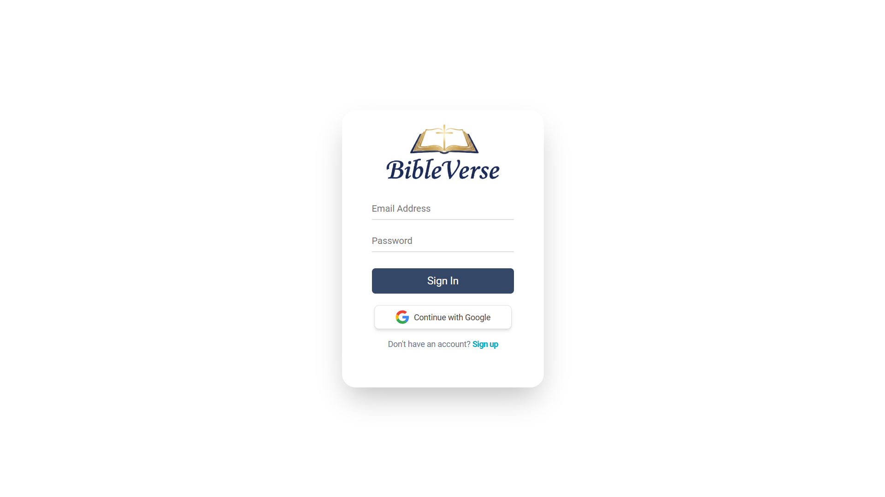

# 🙏BibleVerse App

A Bible browsing and reading web application built with **Next.js , TypeScript, TailwindCSS, Supabase, Docker, and Google Cloud Run** with Scripture data by [API.Bible](https://api.bible/api-reference)**
Users can explore books and chapters, search across all verses, and save notes for each chapter to support depper study.

**Visit Here:** [https://bible-verse-979607262100.asia-southeast1.run.app](https://bible-verse-979607262100.asia-southeast1.run.app)

**Live Demo:** https://youtu.be/uj23JAGdaKE



## Technology

| Technology                                                                        | Description                                  |
| --------------------------------------------------------------------------------- | -------------------------------------------- |
| Next.js                                                                           | React framework for web apps.                |
| TypeScript                                                                        | Typed JavaScript for reliability.            |
| Supabase (BaaS)                                                                   | Backend As A Service with auth and database. |
| TailwindCSS                                                                       | Utility-first CSS framework.                 |
| [Argon Dashboard](https://www.creative-tim.com/product/argon-dashboard-tailwind#) | Tailwind UI dashboard components.            |
| [API.Bible](https://api.bible/api-reference)                                      | Bible data (books, chapters, verses).        |
| Docker                                                                           | Container runtime for development and production deployment |
| [Google Cloud Run](https://cloud.google.com/run)                                 | Serverless container hosting platform                       |

<br/>

### Features

- Supabase Authentication
  - Email Password
  - Google OAuth
- View all **Books** and **Chapters**
- Read chapte verses using the API.Bible data
- Save, update, delete notes per chapter of the book
- Notes tied to authenticated user with RLS of Supabase
- Search Page - Search keywords across **All verses**
- **Developer Utilities**
  - Supabase RLS Policies for secure, user-scoped data access
  - Supabase **Migration** included as SQL files for version-controlled schema changes
  - Supabase **Seeders** to populate initial data and improve navigation experience
  - `npm run route-list` to view all registered API routes

<br/>

### Folder Overview

- `/app/api` — API route handlers for server-side logic and data fetching
- `/app/(auth)` — Route group for authentication pages (sign-in, sign-up)
- `/app/(private)` — Route group for protected pages (dashboard, read-bible, search)
- `/app/components` — Reusable UI components used across the application
- `/app/constants` — Centralized constants (paths, config values, etc.)
- `/app/lib/actions` — Actions and API interactions
- `/app/lib/supabase` — Supabase utilities: `server.ts`, `client.ts`, `auth.ts`
- `/app/lib/helpers` — Utility functions and shared helpers
- `/app/lib/types` — TypeScript type definitions and interfaces
- `/supabase/migrations` — Database migration SQL files and seeders
- `/public` — Static assets such as images, icons, and manifest files

<br/>

## Setup Instructions

### 1. Clone the Repository

```bash
git clone https://github.com/m-antoni/bible-verse.git

cd bible-verse
```

### 2. Install Dependencies

```bash
npm install
```

### 3. Environment Variables

Create a `.env.local` file and add the following:

```
# API Website: https://scripture.api.bible (get your api-key and request endpoint)
BIBLE_API_ENDPOINT=
BIBLE_API_KEY=
BIBLE_API_ID=

# SUPABASE
NEXT_PUBLIC_SUPABASE_URL=
NEXT_PUBLIC_SUPABASE_ANON_KEY=
SUPABASE_SERVICE_ROLE_KEY=
NEXT_PUBLIC_SITE_URL=http://localhost:3000
```

### 4. Run the Development Server

```bash
npm run dev
```

### 5. Applying Supabase Migrations (db push)

If you modify SQL migrations or want to sync schema:

```bash
npx supabase db push
```

This will apply your local migration files directly to your Supabase project.

### 6. Route List (optional)

```bash
npm run route-list
```

<br/>

## Docker Setup

### Prerequisites
- Docker Desktop installed (or Docker Engine + docker-compose plugin)
- `.env.local` file with all required variables (see step 3)

### One-Time Setup

Docker Compose reads `.env` by default (not `.env.local`). Run this once:

```bash
# Windows PowerShell
Copy-Item .env.local .env

# or Linux/macOS
cp .env.local .env
```

### Development with Docker (hot-reload, no host Node.js needed)

```bash
# Build the dev image
docker compose build dev

# Start dev server with hot-reload
docker compose up dev
```

App is available at `http://localhost:3000`. Code changes on your host reflect immediately.

### Production Build & Run

```bash
# Build the production image
docker compose build

# Start the container
docker compose up -d
```

### Push to Docker Hub

```bash
# Login
docker login

# Tag and push
docker tag bible-verse_app:latest your-username/bible-verse:latest
docker push your-username/bible-verse:latest
```

### Deploy to Cloud Run

```bash
gcloud run deploy bible-verse --image your-username/bible-verse:latest --port 3000
```

> **Note:** Server-side secrets (`BIBLE_API_KEY`, `BIBLE_API_ID`, `SUPABASE_SERVICE_ROLE_KEY`) must be set as environment variables in Cloud Run.

### OAuth Configuration for Cloud Run

If Google OAuth is broken after deployment, register your Cloud Run URL in:
1. **Google Cloud Console** → OAuth redirect URIs
2. **Supabase Dashboard** → Authentication → URL Configuration

See [`docker_setup.md`](docker_setup.md) for detailed OAuth setup instructions.

<br/>

## License

This project is open-source and available under the MIT License.

## Author

**Michael B. Antoni**  
LinkedIn: [https://linkedin.com/in/m-antoni](https://linkedin.com/in/m-antoni)  
Email: michaelantoni.tech@gmail.com
