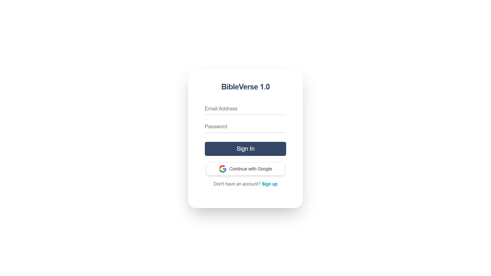

# 🙏BibleVerse App

A Bible browsing and note-taking web application built with Next.js , TailwindCSS and Supabase. Users can explore books and chapters, search across all verses, and save personalized notes for each chapter of the book.

**Visit Here:** [https://m-antoni-bibleverse.vercel.app](https://m-antoni-bibleverse.vercel.app)



## Technology Used

- **NextJS**
- **Supabase (BaaS)**
- **Supabase Auth** (Email/Password + Google OAuth)
- **TailwindCSS**
- **Bible API** – https://scripture.api.bible/

## Features

### Bible Content

- View all **Books** and **Chapters**
- Read chapter Scriptures using the Scripture API

### Notes System

- Save notes per chapter of the book
- Update existing notes
- Delete notes
- Notes tied to authenticated user

### Search Page

- Search keywords across **all verses**
- Results link directly to the specific chapter

### Supabase Tools

- Supabase **migration** files
- Supabase **seeders** for improved navigation

### Developer Utilities

- `npm run route-list` to view all registered API routes

## Getting Started

### 1. Clone the Repository

```bash
git clone https://github.com/m-antoni/bible-verse.git
cd bible-verse
```

### 2. Install Dependencies

```bash
npm install
```

### 3. Environment Variables

Create a `.env.local` file and add the following:

```
# API Website: https://scripture.api.bible (get your api-key and request endpoint)
BIBLE_API_ENDPOINT=
BIBLE_API_KEY=
BIBLE_API_ID=

# SUPABASE
NEXT_PUBLIC_SUPABASE_URL=
NEXT_PUBLIC_SUPABASE_ANON_KEY=
SUPABASE_SERVICE_ROLE_KEY=
NEXT_PUBLIC_SITE_URL=http://localhost:3000
```

### 4. Run the Development Server

```bash
npm run dev
```

### 5. Applying Supabase Migrations (db push)

If you modify SQL migrations or want to sync schema:

```bash
npx supabase db push
```

This will apply your local migration files directly to your Supabase project.

### 6. Route List (optional)

```bash
npm run route-list
```

---

## License

This project is open-source and available under the MIT License.

## Author

**Michael B. Antoni**  
LinkedIn: [https://linkedin.com/in/m-antoni](https://linkedin.com/in/m-antoni)  
Email: michaelantoni.tech@gmail.com
